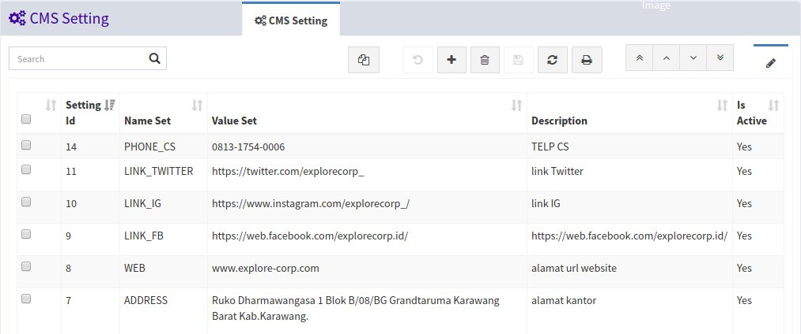
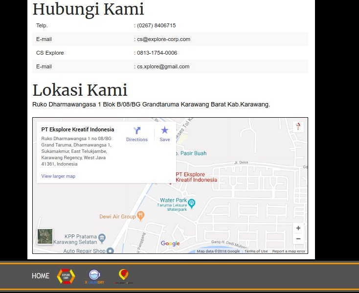

<h1><i class="fa fa-gears"></i> CMS Setting</h1>

Menu `CMS Setting` digunakan untuk mengelola data kontak seperti alamat email, facebook, twitter dsb.

		Note:
		Supaya data setting tampil pada web pastikan status is active nya menjadi Yes

*Tampilan menu CMS Setting*

*Tampilan setting pada website*
