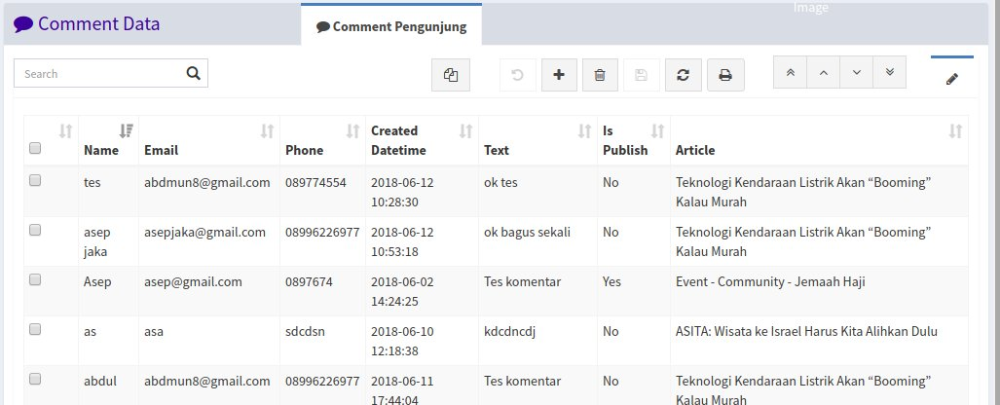
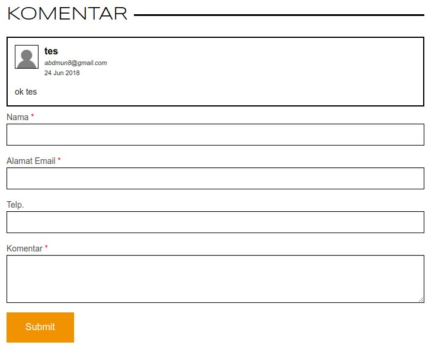

<h1><i class="fa fa-comment"></i> Comment Data</h1>

Menu `Comment Data` digunakan untuk mengelola komentar yang ada pada artikel.

		Note:
		Untuk menampilkan komentar, pastikan status komentar sudah dirubah menjadi publish!
		Pada saat ada yang memasukan komentar pada website, maka program secara otomatis akan mengirimkan email pemberitahuan ke alamat markom.explore@gmail.com.

*Tampilan menu comment data*

*Tampilan Komentar pada website*
