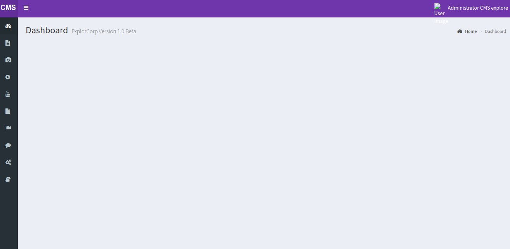
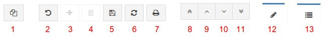
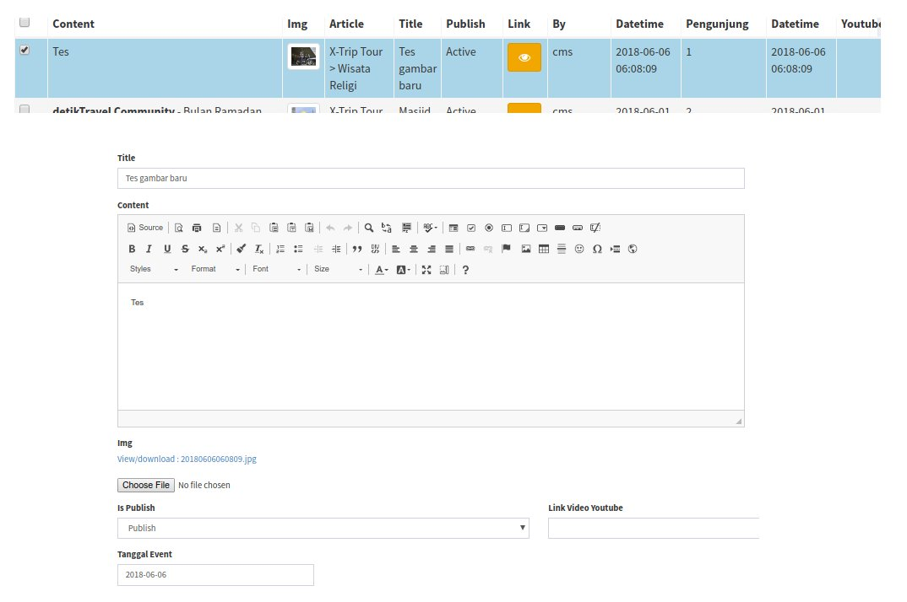
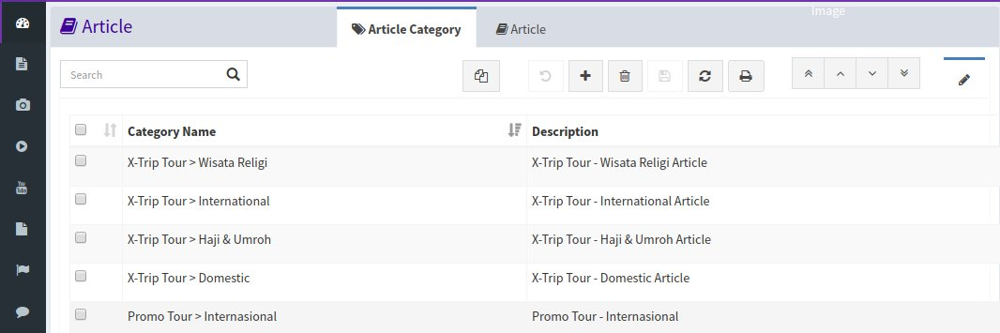
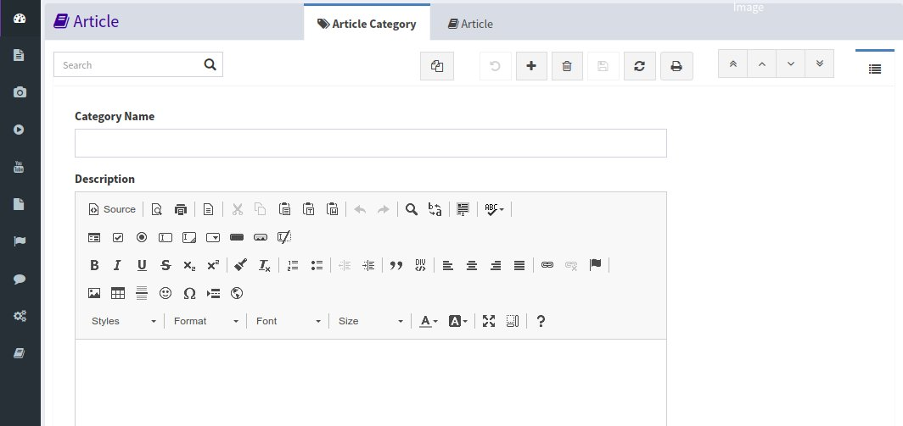

<h1><i class="fa fa-dashboard"></i> Dashboard</h1>

Dashboard adalah halaman utama admin, sebagai beranda pada saat login berhasil.
untuk login admin silahkan klik [disini <i class="fa fa-external-link"></i>](http://explore-corp.com/admin)

*Tampilan Dashboard*

# <i class="fa fa-compass"></i> Toolbar Menu

Toolbar adalah button yang digunakan untuk memberikan aksi pada record.
semua menu pada website ini menggunakan toolbar yang sama seperti gambar dibawah ini

*Tampilan Toolbar*

##  1. Copy Record <i class="fa fa-copy"></i>

Tombol `Copy Record` Digunakan untuk menduplikasi data ke form input. 
Untuk menggunakan pilih satu record dan klik tombol copy record.
maka data pada record yang akan dicopy secara otomatis mengisi form input.

*Contoh Copy Record*

##  2. Undo <i class="fa fa-undo"></i>

Tombol `Undo` digunakan untuk membatalkan perintah yang sudah dilakukan tetapi sebelum di save, seperti copy record atau Tambah Data.

##  3. New <i class="fa fa-plus"></i>

Tombol `New` Digunakan untuk menambahkan data baru.

##  4. Trash <i class="fa fa-trash-o"></i>

Tombol `Delete` digunakan untuk menghapus data.
Untuk menghapus data, pilih salah satu record kemudian klik tombol Delete.

##  5. Save Changes <i class="fa fa-save"></i>

Tombol `Save Changes` digunakan untuk menyimpan perubahan yang telah dibuat, baik itu record baru atau edit record.
Pada saat membuat data baru tombol save changes akan otomatis aktif, begitu juga pada saat melakukan perubahan data.

		Untuk mengedit data, double click pada data yang akan diedit.
		Tampilan akan berubah dari grid view ke form view (dibahas dibawah).

## 6. refresh <i class="fa fa-refresh"></i>

Tombol `Refresh` digunakan untuk memuat ulang data yang ada (reload).

## 7. Print <i class="fa fa-print"></i>

Tombol `Print` digunakan untuk mencetak dokumen, pada website ini tombol tidak digunakan.

## 8. First Record <i class="fa fa-angle-double-up"></i>

Tombol `First Record` digunakan untuk navigasi ke record pertama.

## 8. Previous Record <i class="fa fa-angle-up"></i>

Tombol `Previous Record` digunakan untuk navigasi ke record sebelumnya dari recird yang dipilih.

## 9. Next Record <i class="fa fa-angle-down"></i>

Tombol `Next Record` digunakan untuk navigasi ke record selanjutnya dari recird yang dipilih.

## 10. last Record <i class="fa fa-angle-double-down"></i>

Tombol `Last Record` digunakan untuk navigasi ke record Terakhir.

## 11. Form View <i class="fa fa-pencil"></i>

Tombol `Form View` digunakan merubah tampilan ke tampilan form (pada saat tampilan berada pada tampilan grid).

*Contoh tampilan Grid View*

## 11. Grid View <i class="fa fa-list"></i>

Tombol `Grid View` digunakan merubah tampilan ke tampilan form (pada saat tampilan berada pada tampilan grid).

*Contoh tampilan Form View*

