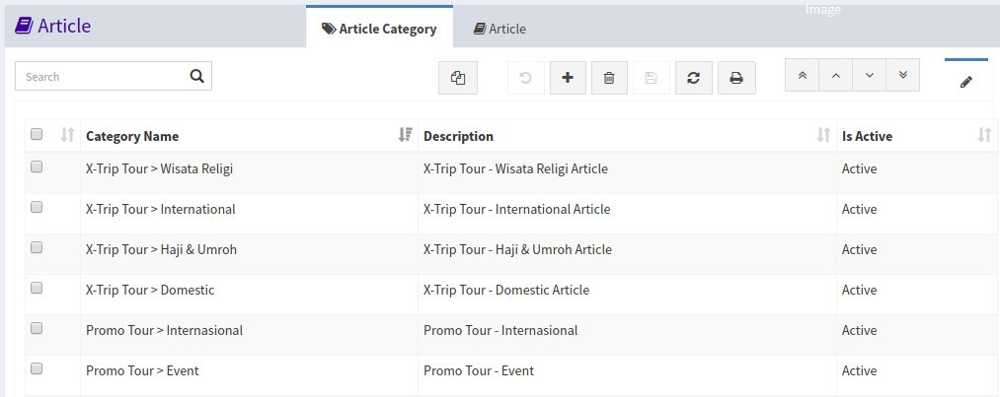
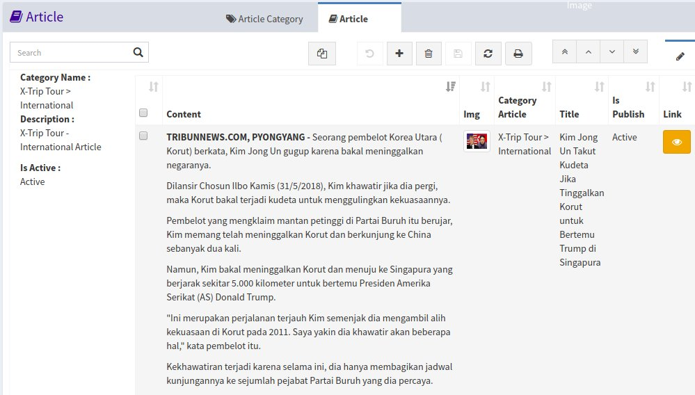
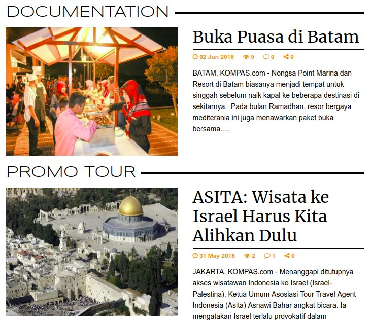
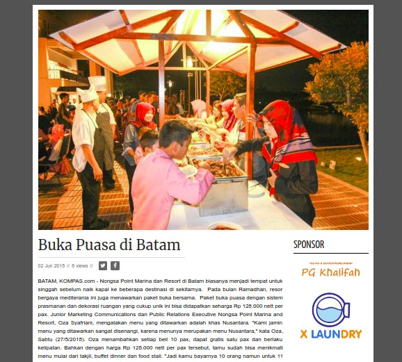
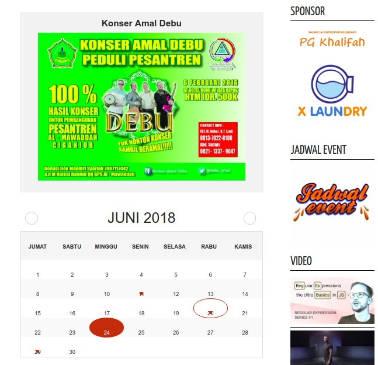

<h1><i class="fa fa-file-text"></i> Data Article</h1>

Menu `Data Article` adalah untuk menambahkan semua kategori artikel yang ada, dibedakan berdasarkan jenisnya yaitu sebagai berikut:

- Event > Domestik
- Event > International
- Event > Wisata Religi
- Event > Haji & Umroh
- X-Trip Tour > X-Trip
- X-Trip Tour > Event
- Documentation > Domestik
- Documentation > Internasional
- Documentation > Event
- Promo Tour > Domestik
- Promo Tour > Internasional
- Promo Tour > Event

## <i class="fa fa-tags"></i> Article Category

Tab `Article Category` berfungsi untuk mengelola data artikel kategori yang ada pada website, article category ini tidak boleh dirubah.

*Tampilan Article category*

## <i class="fa fa-book"></i> Article

Tab `Article` berfungsi untuk mengelola data artikel, untuk mengelola data pastikan anda memilih salah satu Article Category, kemudian klik tab article.

*Tampilan Article*

## Tampilan Pada Website

Article yang telah dibuat pada menu data article akan ditampilkan berdasarkan tiap category pada menu website, article yang paling baru akan tampil pada halaman utama website, supaya article bisa tampil pastikan status article tersebut sudah **publish**.

		Note: 
		Pada saat membuat article jadwal event pastikan tanggalnya diisi!
		untuk memasukan link video dari youtube, yang diinput hanya id nya saja, 
		contoh link: https://www.youtube.com/watch?v=2etgttliU_A 
		maka yang diambil hanya 2etgttliU_A (setelah tanda =)

*Tampilan Article pada halaman utama*

*Tampilan Article pada detail article*

*Tampilan Article pada Jadwal Event*
