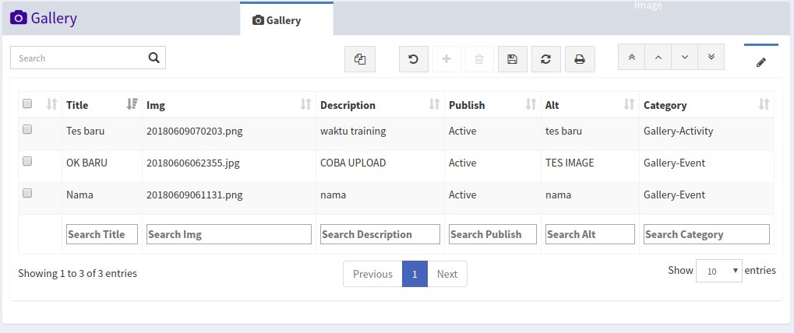
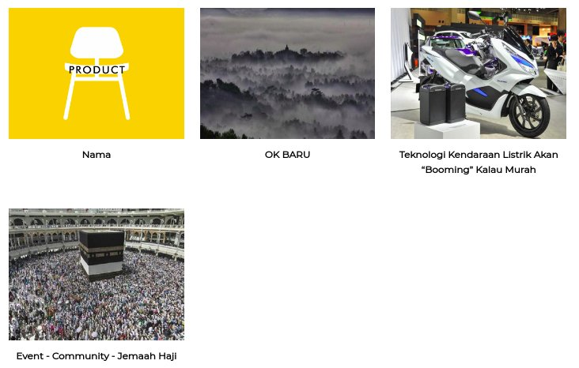
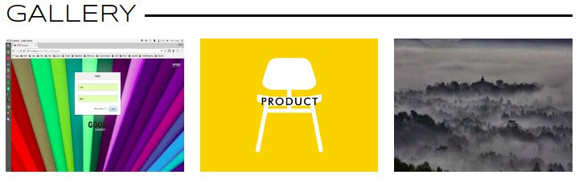

<h1><i class="fa fa-image"></i> Gallery</h1>

Menu `Gallery` digunakan untuk mengelola gambar yang ada pada menu gallery website, gambar yang ada pada menu gallery website tidak semua berasal dari menu gallery, tetapi ada juga gambar dari article, jika ada gambar yang tidak ada pada menu gallery, berarti gambar tersebut berasal dari article yag sudah publish.

Pada website gambar akan ditampilkan berdasarkan kategori gambar yang dipilihm kategorynya adalah sebagai berikut:

- `Event` Untuk gambar event
- `X-Trip Tour` Untuk gambar X-Trip Tour
- `Activity` Untuk gambar Activity (Behind The Scene)

		Note:
		Pada saat mengupload gambar pastikan ukuran gambar tidak lebih besar dari 2MB!
		Gambar terbaru akan tampil di halaman awal website

*Tampilan menu galery*

*Tampilan menu galery website*

*Tampilan galery pada homepage website*
