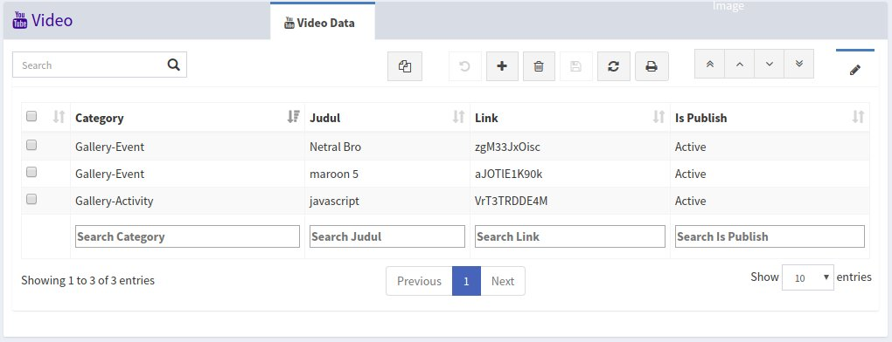
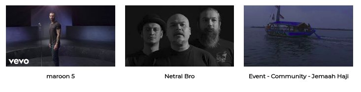
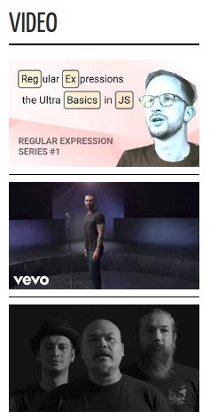

<h1><i class="fa fa-youtube"></i> Video</h1>

Menu `Video` digunakan untuk mengelola video yang ada pada menu video website, video yang ada pada menu video website tidak semua berasal dari menu video, tetapi ada juga yang dari article, jika ada video yang tidak ada pada menu video, berarti video tersebut berasal dari article yag sudah publish.

Pada website video akan ditampilkan berdasarkan kategori video yang dipilihm kategorynya adalah sebagai berikut:

- `Event` Untuk video event
- `X-Trip Tour` Untuk video X-Trip Tour
- `Activity` Untuk video Activity (Behind The Scene)

		Note: 
		Video terbaru akan tampil di halaman awal website
		untuk memasukan link video dari youtube, yang diinput hanya id nya saja, 
		contoh link: https://www.youtube.com/watch?v=2etgttliU_A 
		maka yang diambil hanya 2etgttliU_A (setelah tanda =)

*Tampilan menu video*

*Tampilan menu video website*

*Tampilan video pada homepage website*
